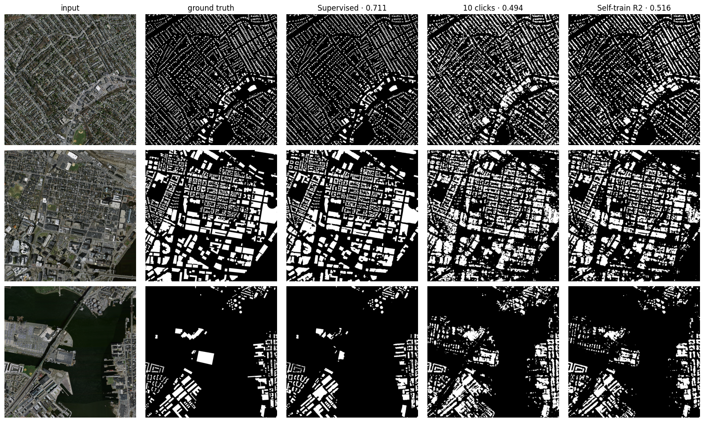
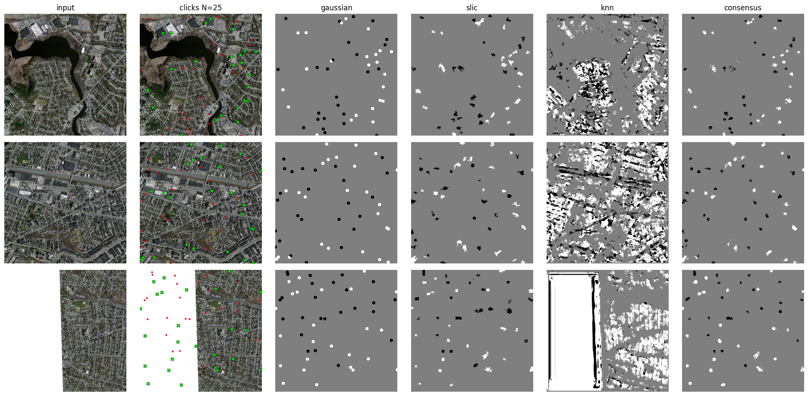

# From Clicks to Footprints

### Point-Supervised Building Segmentation and the Limits of Self-Training — A Pilot Study



**Fig. 1 — Test tiles: input · ground truth · fully supervised (fg IoU 0.711) · 10 clicks/tile (0.494) · self-training round 2 (0.516).**

Dense pixel annotation is the dominant cost in remote-sensing segmentation. This project asks a simple question: **how far can we get with 10 clicks per image?**

**TL;DR — 10 clicks per tile (~0.0004% of pixels, ~30 minutes of annotation for the entire dataset) recovers ~70% of fully-supervised performance. One round of self-training adds a measured +0.017 IoU; further rounds saturate. We document why.**

## Main Results (test set, fg IoU)

| Method | Supervision | Test fg IoU | F1 |
|---|---|---|---|
| Supervised ceiling | 100% of pixels | **0.711 ± 0.001** | 0.831 |
| Self-training round 2 (committee) | 30 clicks/tile + pseudo-labels | 0.516 | 0.681 |
| Self-training round 1 | 30 clicks/tile + pseudo-labels | 0.511 | 0.676 |
| Partial Focal CE (baseline) | **10 clicks/tile** | **0.494 ± 0.002** | 0.662 |

*Self-training rows are single-seed pilots; the round-1 gain is consistent in direction across the validation and test splits.*

## The Three Findings

### Finding 1 — Clicks are absurdly efficient

Ten clicks per tile reach ~70% of the supervised ceiling, and the spread across **three simulated annotators is ±0.002** — the result barely depends on where the clicks land.


**Fig. 2 — Week-1 anchors (validation): supervised 0.657 ± 0.004 vs clicks-only 0.453 ± 0.007.**

The baseline has exactly one weakness, and it is visible in its training curve: **memorization**. The clicks-only model peaks around epoch 25, then declines while its training loss keeps falling — it eventually fits its 1,370 clicked pixels perfectly, and fitting the dots better stops meaning seeing buildings better.


**Fig. 3 — The click-memorization trap: the red curve peaks at epoch ~25 ("click memorization begins") and slowly decays, while the supervised curve (blue) is stable.**

### Finding 2 — One-shot label propagation fails on this data

The classic weak-supervision recipe says: grow clicks into pseudo-masks *before* any training. We tested it thoroughly — Gaussian blobs, multi-scale SLIC superpixels, and feature-space k-NN over frozen ImageNet encoder features, with full parameter sweeps. **Ten configurations. Best pseudo-label IoU: 0.234 — below the trained clicks-only model itself.**


**Fig. 4 — Pseudo-label quality vs. annotation budget: every grower stays far below the dashed reference line (the trained clicks-only model, 0.494).**



**Fig. 5 — Clicks → grown pseudo-masks: Gaussian blobs, SLIC superpixels, feature k-NN, and their 2-of-3 consensus (N = 25 clicks per class per tile).**

**Diagnosis:** at 1 m/pixel, buildings are ~20×20 px and gray roofs look like gray roads. Separating them requires *learned* appearance — which a trained model has and a frozen encoder does not. Propagation without training cannot beat training.

### Finding 3 — Self-training saturates after one round — and we can say why

Three click-trained teachers are ensembled and confidence-gated into pseudo-labels (82.7% precision at the chosen threshold). The round-1 student gains **+0.017 IoU** (0.494 → 0.511) and visibly recovers additional buildings in Fig. 1. Round 2 stalls (+0.005) for a measurable reason:

- Focal-trained teachers are **soft** — their confidence gates well (82.7% precision).
- The self-trained student becomes **loud and overconfident** — its confidence stops predicting correctness (58.8% precision at the same gate), and it replays memorized label noise on its own training tiles.
- Committee averaging (teachers + student) repairs the gate (80.4% precision), but the chain has converged: the label pipeline is recycling the same knowledge.

## What Makes This Repo Different: The Protocol

Every number above survives the questions that kill weak-supervision papers:

- **Frozen, seeded annotation** — clicks are sampled once per tile, exported as JSON manifests (the literal annotation file a human would hand you), never re-sampled.
- **Leak-proof by construction** — the weak training dataset is built *without* dense ground truth; leaking is physically impossible, not merely avoided.
- **Annotation-budget accounting** — click sets are nested across N (N=10 ⊃ N=5), modeling incremental annotator effort.
- **Dataset-level fg IoU on full 1500×1500 tiles** (windowed inference) — no background-inflated mean IoU.
- **Three seeds = three simulated annotators** — the reported spread is annotator variance.
- **Test set touched exactly once**, at the end, for the final table.
- **Reproducible across sessions** — all seeds fixed; results re-verified after an independent re-run.

## Repository Layout

```text
├── README.md
├── images/        # all report figures (Figs. 1–5)
├── report/        # technical report (PDF)
├── annotations/   # frozen click manifests (JSON, ~21 KB each)
└── notebooks/     # protocol · propagation study · self-training
```

## Reproduction

Python 3.10+, PyTorch, `segmentation-models-pytorch`, `torchgeo`, `torchvision`, `scikit-image`, `pandas`. Run the notebooks in order; all seeds are fixed and every artifact (checkpoints, histories, manifests) is written to `wsss_runs/`.

## Limitations & Future Work

Single dataset (Massachusetts Buildings), single architecture (U-Net/ResNet-34), single-seed self-training rounds. The measured 0.20 IoU gap between self-training and full supervision is the target for **consistency regularization** (Mean Teacher / FixMatch-style), stronger encoders, click-per-object protocols, and the annotation-efficiency sweep (N = 1…100) — see the report.

## Citation

```bibtex
@techreport{clicks2footprints2025,
  title  = {From Clicks to Footprints: Point-Supervised Building Segmentation
            and the Limits of Self-Training},
  author = {Asghar Qamber Rizvi},
  year   = {2026},
  url    = {https://github.com/asghar-rizvi/Point-Supervised-Building-Segmentation-},
}
```
